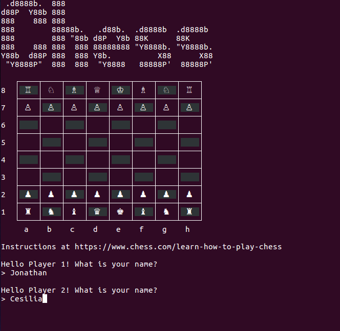
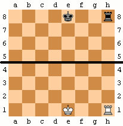
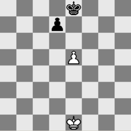
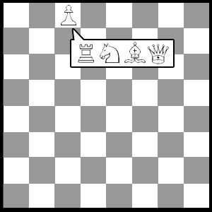
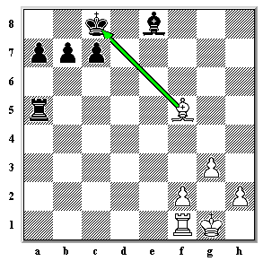

# Chess Project

The goal of this project is to implement a command line [Chess](https://en.wikipedia.org/wiki/Chess) game using Ruby.

This is a project from [The Odin Project](https://www.theodinproject.com/courses/ruby-programming/lessons/ruby-final-project).



## Installation

Open your Terminal/Command Line. Navigate to the directory where your version will live. Type in the following:

```
$ git clone https://github.com/JonathanYiv/chess.git
$ cd chess
$ ruby lib/game.rb
```

## Pre-Project Thoughts

1. I reflected on how to represent the chess pieces. They will have multiple values: their x-position, y-position, moveset, and icon. I could do a several layers deep mixture of hash/array, but accessing the necessary data would be ugly. Therefore, I will use classes.

2. Had a discussion with @benjaminapetersen about Composition vs Inheritance. Read about 'has-a' vs 'is-a' relationships. Realized that for the scope of this project, chess pieces don't need to inherit anything nor would their small pieces of functionality need to be extracted into something like a module.

3. I have been looking forward to this project for a very long time. I heard talk of it in the chat, then peeked forward at it earlier, and was excited to tackle this. It will definitely be a notch in my belt.

4. I think the most difficult things to implement will be the various odd rules, like 'en passant' and 'promotion of pawns.'

5. I wonder how long this will take me. Well, here we go.

### Rules to Consider

1. Castling

	1. Description

		1. The King moves two spaces to the right or left

		2. The Rook moves over the King to be on the opposite side of the King

	2. Conditions

		1. The King has never moved

		2. The Rook has never moved

		3. The squares between the King and Rook are unoccupied

		4. The King will not castle out of, through, or into check



2. En Passant

	1. Description

		1. After a Pawn moves two ranks forward, an enemy adjacent Pawn may capture the Pawn diagonally on the turn immediately afterward.

	2. Condition

		1. The capturing Pawn must be on its fifth rank.

		2. The captured Pawn must be on an adjacent square.

		3. The captured Pawn must have moved two squares in a single move.

		4. The capture can only be made on the move immediately after the double-step move.



3. Promotion

	1. Description

		1. When a Pawn reaches its eighth rank, it can be replaced by a: Queen, Knight, Rook, or Bishop

		2. The choice is not limited to previously captured pieces.



4. Check

	1. Description

		1. When a King is under threat of capture.

		2. It can be exited by interposing a piece, capturing the threatening piece, or moving the King.

		3. If the player can not exit check, then it is checkmate and the player loses.

		4. Kings may not move into check.



### Project Structure

```ruby
class GameBoard
	instance variables:
		@positions: a 2D array containing where all the chess piece instances are located
		@player1
		@player2
		@turn_counter: initially 1
	methods:
		initialize: instantiates @positions and places pieces
			place_pieces: creates all piece instances and places them in their default starting state
		play: starts the game by calling submethods
			title: displays ASCII chess title
			display: displays the board based on where pieces are
			instructions: displays the game instructions
			get_names: sets @player1 and @player2 to Player instances
			turns: starts the turn loop, using @turn_counter to determine whose turn it is
				turn: prompts the appropriate player for user input
				convert: converts a move input to the correct position on the @positions 2D array
				move: moves a chess piece, also calls find_possible_moves to update its moveset
				promote?: checks if a pawn has reached the end of the board, if so, prompt the appropriate player to promote it to a queen/knight/rook/bishop
				check?: checks if a check is in play, if so, mandates that the next turn has the player move their king by setting all other @possible_moves to nothing
				checkmate?: checks if a checkmate is in play, if so, the game ends and a player wins
					win: displays winning text for the appropriate player
					lose: displays losing text for the appropriate player
		save: serializes @positions, @player1, @player2, and @turn_counter
		load: loads serialized data into the game and sets instance variables equal to it

class Player
	instance variables:
		@name
	methods:
		initialize: instantiates and prompts for names
			get_name: gets user input for name
		take_turn: gets user input for piece to move and where to move


class King/Rook/Bishop/Queen/Knight/Pawn
	instance variables:
		@moveset
		@x_position
		@y_position
		@possible_moves
		@icon
	methods:
		initialize(black/white): creates instance variables, takes in a parameter to determine icon color
		find_possible_moves: when initialized, @possible_moves calls this to create an array for its value. Is passed in @positions to help calculate

Additionally:
	class King/Rook/Pawn
		instance variable:
			@has_moved: true or false for castling and pawn double-step move
	class Pawn
		instance variable:
			@double_stepped: true immediately after using a double-step move
```

## Post-Project Thoughts

This project is currently incomplete.

1. Cloning: Behold, my greatest failure as of yet. This was the longest I have ever taken to solve a bug. So here's the story...

	1. First Iteration: In order for me to calculate the King's possible moves, I needed to evaluate the possible moves of all other pieces to make sure the King didn't move into check. So I iterated through every existing piece and compared them to the King's possible moves to determine which were valid.

	2. Second Iteration: Then, I realized that a given piece's possible moveset would not include a friendly piece adjacent to the King, because it can't capture friendly pieces. However, the King could capture that piece and put itself into check via the given piece's moveset. So I created a 'deep clone' of the board. I iterated through every position on the board and cloned the object into the clone board. I moved the King to the potential move-spot and then calculated the new possible movesets accordingly. This didn't work, because it would calculate the possible moveset of the enemy King, which would create another clone board, which would calculate the moveset of the enemy King... stack overflow.

	3. Third Iteration: When iterating through the pieces on the clone board, I created an if/else to isolate the King, and simply added all adjacent squares into that King's possible movesets. That seemed to work until I found out that the Black King somehow could capture his friendly adjacent pieces.

	4. Fourth Iteration: This took me two days to realize, but the 'deep clone' I had created earlier still wasn't deep enough! The objects that were cloned still had instance variables, and in the case of the instance variable @possible_moves, it wasn't creating a copy, it was simply pointing to the same object! I made the clone deeper and that fixed the problem.

2. Pry: @105ron linked me to pry when I sought help for the above problem. I learnt some of the basics including 'binding.pry' and, although it didn't help me debug the cloning problem, I can see it is very useful and will add it to my debugging toolbelt.

3. Safe Navigation Operator: I learned about the "&" operator. It checks for nil before calling a method. 

	1. Example: variable&.method

		2. If variable is nil, it will return nil.
	
		3. If variable is not nil, it will call the method.

4. I have tried changing GitHub's tab size to 2, even modifying the file itself by ending a comment or something, but it always reverts to a displayed tab size of 8. Does anyone know how to fix this?

5. Thanks to some feedback from @hwchan91, I made several changes to make my code more modular and readable, including changing the name of some variables/methods and splitting a few large methods into multiple smaller methods.

6. After completing the project, I realized there are several areas I need to improve upon:

	1. Making methods more modular. Right now, my methods do too much. I should have been better able to abstract concepts and make more methods doing less things.

	2. Debugging. Going into this project, I mostly did output debugging. With this project, I've used a lot more testing and pry as additional tools to help me narrow down the problem. This process was slow for me because I had to think about what I was doing. With more practice, I hope my debugging skills improve.

	3. More coverage with unit tests. Sometimes in a rush, I would simply fully write the method without writing any tests. Sometimes these methods would perform complicated procedures and it would bite me in the butt later when the method had undesired behavior. I'd have to go back and write tests for specific scenarios and then hunt down where exactly it broke.

7. Overall, I am very happy that I completed this project. It was a worthy venture.

8. After the fact, I realized I had forgotten that one of the project requirements was the ability to save and load files. I am rather burnt out on chess at the moment, so I will come back later and implement it. Onwards to Rails!
